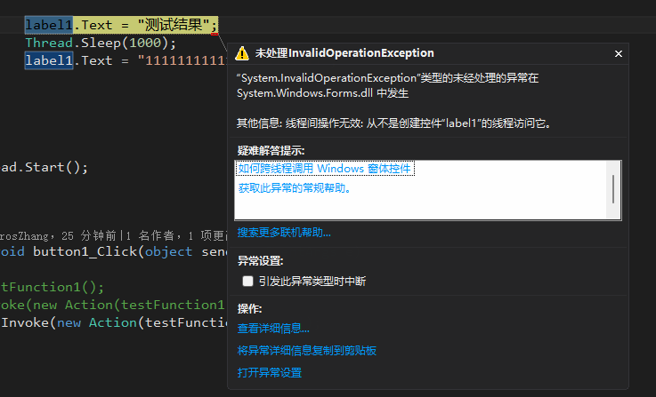

# 测试多线程

> 这里是因为在 `Winform` 上位机中，使用多线程的话，会存在一个跨线程调用数据的问题。

```C#
Thread _thread = new Thread(() =>
{
    Invoke(new Action(() =>
    {
        label1.Text = "测试结果";
        Thread.Sleep(1000);
        label1.Text = "1111111111111111111111";
    }));

});

_thread.Start();
```

即要在线程中使用委托 `Invoke` 的形式进行调用label1的数据，这样才不会报错。


